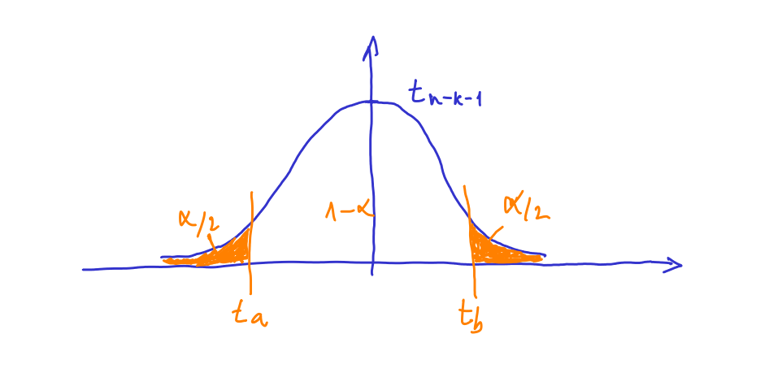

```{r setup, include=FALSE}
knitr::opts_chunk$set(echo = TRUE)
```

# Intervalo de confianza para las $\beta_i$

Se quiere obtener un intervalo $(LI,LS)$ tal que

$$
P(LI \leq \beta_i \leq LS) = 1-\alpha
$$

A dicho intervalo se le llama *intervalo de confianza con nivel de confianza* $1-\alpha$. Un intervalo de confianza para un parámetro se puede entender como **un rango de valores posibles para dicho parámetro**.

## Con matrices de datos

Hemos visto que

$$
\hat \beta \rightarrow N(\beta, \sigma^2 Q)
$$

donde $Q = (X^TX)^{-1}$:

$$
Q
=
\begin{bmatrix}
q_{00} & q_{01} & \cdots & q_{0k} \\
q_{10} & q_{11} & \cdots & q_{1k} \\
\cdots & \cdots & \cdots & \cdots \\
q_{k0} & q_{k1} & \cdots & q_{kk} \\
\end{bmatrix}
$$

Es decir:

$$
\begin{bmatrix}
\hat{\beta}_0 \\ \hat{\beta}_1 \\ \cdots \\ \hat{\beta}_k \\
\end{bmatrix}
\sim
N \left(
\begin{bmatrix}
\beta_0 \\ \beta_1 \\ \cdots \\ \beta_k \\
\end{bmatrix}
,
\sigma^2
\begin{bmatrix}
q_{00} & q_{01} & \cdots & q_{0k} \\
q_{10} & q_{11} & \cdots & q_{1k} \\
\cdots & \cdots & \cdots & \cdots \\
q_{k0} & q_{k1} & \cdots & q_{kk} \\
\end{bmatrix}
\right)
$$

Esto implica que:

$$
\hat \beta_i \rightarrow N(\beta_i, \sigma^2 q_{ii}), \quad i = 0,1,2, \ldots,k
$$

Aplicando las propiedades de la distribución normal

$$
\frac{\hat \beta_i - \beta_i}{ \sqrt{ \sigma^2 q_{ii} }} \rightarrow N(0,1), \quad i = 0,1,2,\cdots,k.
$$
Si se tiene en cuenta que:

$$
\frac{(n-k-1)\hat{s}_R^2}{\sigma^2} \sim \chi^2_{n-k-1}
$$

y de acuerdo con el [Apendice: Distribución t-student](lm_apendice_tn.html), se puede obtener que

$$
\frac{\hat \beta_i - \beta_i}{\sqrt{ \hat s_R^2 q_{ii}}} \sim t_{n-k-1}, \quad i = 0,1,2,\cdots,k.
$$

Al denominador se le suele llamar *desviación típica del estimador*, o *standard error del estimador*: 

$$se(\hat \beta_i) = \sqrt{ \hat s_R^2 q_{ii}}, \quad i = 0,1,2,\cdots,k.$$

Por lo que se puede escribir

$$
\frac{\hat \beta_i - \beta_i}{se(\hat \beta_i)} \rightarrow t_{n-k-1}, \quad i = 0,1,2,\cdots,k.
$$

Se eligen dos valores $t_a$ y $t_b$ que cumplen que:

$$
P(t_a \leq t_{n-k-1} \leq t_b) = 1-\alpha
$$



Por tanto se tiene que cumplir que:

$$
P \left( t_a \leq \frac{\hat \beta_i - \beta_i}{se(\hat \beta_i)} \leq t_b \right) = 1-\alpha
$$

Reordenando términos:

$$
P \left( \hat \beta_i - t_b se(\hat \beta_i)\leq \beta_i \leq \hat \beta_i - t_a se(\hat \beta_i) \right) = 1-\alpha
$$

Como la distribución es simétrica se cumple que 

$$
-ta = tb = t_{\alpha/2}
$$

$$
\Rightarrow P \left( \hat \beta_i - t_{\alpha/2} se(\hat \beta_i) \leq \beta_i \leq \hat \beta_i + t_{\alpha/2} se(\hat \beta_i) \right) = 1-\alpha
$$

Comparando esta ecuación con $P(LI \leq \beta_i \leq LS) = 1-\alpha$, se cumple que

$$
LI = \hat \beta_i - t_{\alpha/2} se(\hat \beta_i)
$$

$$
LS = \hat \beta_i + t_{\alpha/2} se(\hat \beta_i)
$$

Por tanto, el intervalo de confianza $100(1-\alpha)$% se obtiene como

$$
\hat \beta_i \pm t_{\alpha/2} se(\hat \beta_i), \quad i = 0,1,2,\cdots,k.
$$


## Con matrices de covarianzas

Tenemos que

$$
\hat{\beta}_a \rightarrow N(\beta_a, \sigma^2 Q_a)
$$

donde

$$
Q_a = \frac{1}{n-1}S_{XX}^{-1}
$$ 

Esto implica que:

$$
\hat \beta_i \rightarrow N(\beta_i, \sigma^2 Q_{a(i,i)}), \quad i = 1,2, \ldots,k
$$

donde $Q_{a(i,j)}$ es el elemento *(i,j)* de la matriz $Q_a$. Por tanto, siguiendo el razonamiento del apartado anterior:

$$
se(\hat \beta_i) = \sqrt{ \hat s_R^2 Q_{a(i,i)}}, \quad i = 1,2,\cdots,k
$$

Para $\hat \beta_0$ tenemos que

$$
\hat \beta_0 \sim N \left( \beta_0, \sigma^2 \left( \frac{1}{n} + \frac{1}{n-1} \bar x^T S_{XX}^{-1} \bar x \right) \right)
$$

Por tanto

$$
se(\hat \beta_0) = \sqrt{\hat s_R^2 \left( \frac{1}{n} + \frac{1}{n-1} \bar x^T S_{XX}^{-1} \bar x \right) }
$$

Finalmente, el intervalo de confianza $100(1-\alpha)$% se obtiene como

$$
\hat \beta_i \pm t_{n-k-1;\alpha/2} se(\hat \beta_i), \quad i = 0,1,2,\cdots,k.
$$

# Intervalo de confianza para $\sigma^2$

En este caso se quiere obtener un intervalo $(LI,LS)$ tal que

$$
P(LI \leq \sigma^2 \leq LS) = 1-\alpha
$$

Partimos de la distribución en el muestreo:

$$
\frac{(n-k-1)\hat s_R^2}{\sigma^2} \rightarrow \chi^2_{n-k-1}
$$

Despejando:

$$
\frac{(n-k-1)\hat s_R^2}{\chi^2_{n-k-1;\alpha/2}} \leq \sigma^2 \leq \frac{(n-k-1)\hat s_R^2}{\chi^2_{n-k-1;1-\alpha/2}}
$$
Podemos dibujar la distribución $\chi^2$:

```{r}
curve(dchisq(x,5), from = 0, to =50, col = "blue")
curve(dchisq(x,20), add = T, col = "red")
```

# Ejemplo

Vamos a calcular de manera detallada los intervalos de confianza para el modelo *kid_score ~ mom_iq + mom_hs*:

```{r}
load("datos/kidiq.Rdata")
str(d)
```

## Varianza de $\hat{\beta}$

### Usando matrices de datos

La varianza de los parámetros estimados es $var(\hat \beta_i) = \hat s_R^2 q_{i,i}$:

```{r}
n = nrow(d)
# variable auxiliar
d$mom_hssi = ifelse(d$mom_hs == "si",1,0)
# matriz X
X = cbind(rep(1,n), d$mom_iq, d$mom_hssi)
Xt_X = crossprod(X) # crossprod es otra manera de calcular t(X) %*% X
Xt_y = crossprod(X,d$kid_score)
# parametros estimados
(beta = solve(Xt_X) %*% Xt_y)
```

```{r}
# matriz Q = inv(t(X)*X)
(Q = solve(Xt_X) )
```

La varianza residual es

$$
\hat{s}_R^2 = \frac{\sum e_i^2}{n-k-1}
$$
donde la suma de los residuos al cuadrado se puede calcular con la ecuación

$$
\sum e_i^2 = y^T y - \hat{\beta}^T (X^T y)
$$

```{r}
(SRC = crossprod(d$kid_score) - t(beta) %*% Xt_y )
```

```{r}
# numero de regresores
k = 2
(sR2 = SRC[1,1]/(n-k-1)) # [1,1] porque es mejor tener un numero que no una matriz de tamaño [1,1]
```

Por tanto, la matriz de varianzas de los estimadores será

```{r}
(beta_var = sR2 * Q)
```

Y el standard error de los estimadores, $se(\hat \beta_i)$:

```{r}
(beta_se = sqrt(diag(beta_var)))
```

### Usando matrices de varianzas

Vamos a calcular ahora el standard error de los estimadores con la matriz de varianzas de los regresores:

```{r}
Xa = cbind(d$mom_iq, d$mom_hssi)
(Qa = 1/(n-1)*solve(var(Xa)))
```

El standard error de los estimadores $\hat\beta_1$ y $\hat \beta_2$ son:

```{r}
sqrt(diag(Qa)*sR2)
```

Para $\hat \beta_0$:

```{r}
# vector con las medias de cada x
( xmed = matrix(colMeans(Xa), ncol = 1) )
```

```{r}
sqrt( sR2*(1/n + 1/(n-1)*t(xmed) %*% solve(var(Xa)) %*% xmed ) )
```

### Con R

```{r}
# Se estima el modelo
m = lm(kid_score ~ mom_iq + mom_hs, data = d)
```

```{r}
# como curiosidad, la matriz X se puede obtener como
X1 = model.matrix(m)
# y los residuos
e = m$residuals
# por lo que podríamos obtener la matriz de varianzas de beta como
(sum(e^2)/(n-k-1))*solve(crossprod(X1))
```

Sin embargo R dispone de una función para calcular directamente esa matriz:

```{r}
vcov(m)
```

Por tanto, el standard error de los estimadores será

```{r}
sqrt(diag(vcov(m)))
```

Como vemos, los tres métodos dan el mismo resultado.

## Intervalo de confianza para $\beta_i$

El valor de la t con n-k-1 = `r n - k - 1` grados de libertad es

```{r}
(ta = qt(1-0.05/2, df = n-k-1))
```

El límite inferior (LI) y el límite superior de los intervalos será:

```{r}
(LI = coef(m) - qt(1-0.05/2, df = n-k-1)*beta_se)
(LS = coef(m) + qt(1-0.05/2, df = n-k-1)*beta_se)
```

Si lo juntamos todo en una tabla

```{r}
data.frame(estimacion = coef(m), se = beta_se, LI, LS)
```

Directamente, mediante la función *confint()* de R se pueden obtener dichos valores:

```{r}
confint(m)
```

Si queremos otro nivel de confianza, por ejemplo, 90%:

```{r}
confint(m, level = 0.90)
```

## Intervalo de confianza para $\sigma^2$

El estimador de la varianza es:

```{r}
sR2
```

Y su intervalo de confianza:

```{r}
c((n-k-1)*sR2/qchisq(1-0.05/2, df = n-k-1), (n-k-1)*sR2/qchisq(0.05/2, df = n-k-1))
```

