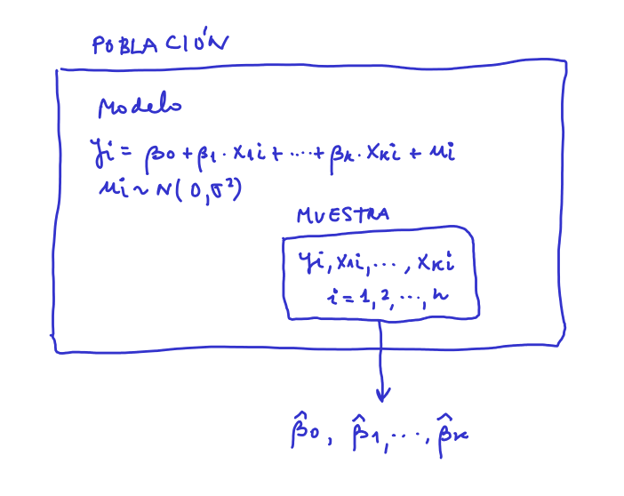

# Ecuación del modelo

El punto de partida son los **datos**, en este caso se tienen los datos del archivo *kidiq.csv*. Se quiere estudiar la relación entre la variable *kid_score* y el resto de variables. A la variable *kid_score* se le conoce como **variable respuesta** y se representa con la letra *y*. A las otras variables se les conoce como **variables explicativas**, **regresores**, **cofactores**,... y se representan con $x_1$, $x_2$,..., $x_k$.

Pero se quiere estudiar la relación entre kid_score y las otras variables de manera general, se quieren obtener conclusiones generales, no limitadas sólo a los datos. Para ello se considera que los datos disponibles son una parte de un conjunto más grande llamado **población** y se define la ecuación que modela dicha relación en la población, que en este caso es:

$$
y_i = \beta_0 + \beta_1 x_{1i} + \beta_2 x_{2i} + \cdots + \beta_k x_{ki} + u_i, \quad u_i \sim N(0,\sigma^2)
$$

-   Esta ecuación se conoce como **modelo de regresión lineal**.
-   El término $y_i$ se conoce como *variable respuesta*: en este caso *kid_score*.
-   $x_1$, $x_2$,..., $x_k$ como **variables explicativas**, **regresores**, **cofactores**,...: en este caso *mom_hs*, *mom_iq*, *mom_work*, *mom_age*.
-   El término $u_i$ representa el error del modelo. En este modelo se considera que el error tiene distribución normal con $E[u_i]=0$ y $Var[u_i] = \sigma^2$.

Este modelo es válido para toda la **población**, es decir, para el conjunto donde se está estudiando el problema, por lo que permite extraer conclusiones generales. Este modelo nos muestra que la relación entre $y \sim x$ es lineal y que depende de unos parámetros: $\beta_0, \beta_1, \beta_2, \cdots, \beta_k$. Estos parámetros son desconocidos. Es decir, se conoce la ecuación del modelo pero no los parámetros del modelo. A partir de los datos o **muestra** se pueden estimar dichos parámetros, que se indicará con $\hat \beta_0, \hat \beta_1, \hat \beta_2, \cdots, \hat \beta_k$. Pero para conocer el valor exacto de $\beta_0, \beta_1, \beta_2, \cdots, \beta_k$ se necesitaría conocer toda la población.

# Forma matricial del modelo

La ecuación del modelo se puede escribir en notación matricial:

$$
i = 1 \Rightarrow y_1 = \beta_0 + \beta_1 x_{11} + \beta_2 x_{21} + \cdots + \beta_k x_{k1} + u_1, \quad u_1 \sim N(0,\sigma^2)
$$

$$
i = 2 \Rightarrow y_2 = \beta_0 + \beta_1 x_{12} + \beta_2 x_{22} + \cdots  + \beta_k x_{k2} + u_2, \quad u_2 \sim N(0,\sigma^2)
$$

$$
\cdots
$$

$$
i = n \Rightarrow y_n = \beta_0 + \beta_1 x_{1n} + \beta_2 x_{2n} + \cdots  + \beta_k x_{kn} + u_n, \quad u_n \sim N(0,\sigma^2)
$$

Agrupando:

$$
\begin{bmatrix}
y_1 \\ y_2 \\ \cdots \\ y_n
\end{bmatrix}
=
\begin{bmatrix}
1 & x_{11} & x_{21} & \cdots  & x_{k1} \\
1 & x_{12} & x_{22} & \cdots  & x_{k2} \\
\cdots &\cdots & \cdots & \cdots & \cdots \\
1 & x_{1n} & x_{2n} & \cdots  & x_{kn} \\
\end{bmatrix}
\begin{bmatrix}
\beta_0 \\ \beta_1 \\ \beta_2 \\ \cdots  \\ \beta_k
\end{bmatrix}
+
\begin{bmatrix}
u_1 \\ u_2 \\ \cdots \\ u_n
\end{bmatrix}
, 
$$

$$
\begin{bmatrix}
u_1 \\ u_2 \\ \cdots \\ u_n
\end{bmatrix}
\sim
N \left(
\begin{bmatrix}
0 \\ 0 \\ \cdots \\ 0
\end{bmatrix},
\begin{bmatrix}
\sigma^2 & 0 & 0 & \cdots \\
0 & \sigma^2 & 0 & \cdots \\
\cdots &\cdots & \cdots & \cdots \\
0 & 0 & 0 & \sigma^2 \\
\end{bmatrix}
\right)
$$

Finalmente:

$$
y = X \beta + u, \quad u \sim N(0,\sigma^2 I)
$$

Esta ecuación es válida para cualquier número de regresores y cualquier número de observaciones.

# Estimación de los parámetros

El método que permite estimar los parámetros del modelo a partir de los datos se conoce como método de máxima verosimilitud. El método tiene dos partes:

1.  Definir la función de verosimilitud.
2.  Maximizar la función de verosimilitud: los estimadores de los parámetros son aquellos que maximizan la verosimilitud.

## Definición de la función de verosimilitud

Dados unos datos $(y_1,y_2,\ldots,y_n)$ se define la función de verosimilitud $L(y,X,\beta,\sigma^2)$ como la función de densidad conjunta de los datos. Se supone que los datos son independientes, por lo que:

$$
L(y,X,\beta,\sigma^2) = f(y_1,y_2,\cdots,y_n) = f(y_1) \cdot f(y_2) \cdots f(f_n)
$$

La distribución $f(y_i)$ se obtiene teniendo en cuenta que:

$$
u_i \sim N(0,\sigma^2) \Rightarrow y_i \sim N(\beta_0 + \beta_1 x_{1n} + \beta_2 x_{2n} + \cdots  + \beta_k x_{kn}, \sigma^2)
$$

ya que

$$
u_i \sim Normal \Rightarrow y_i \sim Normal
$$

$$
E[y_i] = E[\beta_0 + \beta_1 x_{1n} + \beta_2 x_{2n} + \cdots  + \beta_k x_{kn} + u_i] = \beta_0 + \beta_1 x_{1n} + \beta_2 x_{2n} + \cdots  + \beta_k x_{kn}
$$

$$
Var[y_i] = E[\beta_0 + \beta_1 x_{1n} + \beta_2 x_{2n} + \cdots  + \beta_k x_{kn} + u_i] = \sigma^2
$$

Por tanto

$$
f(y_i) = \frac{1}{\sigma (2\pi)^{1/2}}\exp \left( -\frac{1}{2\sigma^2}(y_i-E[y_i])^2 \right) \Rightarrow
$$

$$
f(y_i) = \frac{1}{\sigma (2\pi)^{1/2}}\exp \left( -\frac{1}{2\sigma^2}u_i^2 \right) \Rightarrow
$$

Por tanto

$$
L(y,X,\beta,\sigma^2) = \prod_{i=1}^n f(y_i) = \frac{1}{\sigma^n (2\pi)^{n/2}}\exp \left( -\frac{1}{2\sigma^2} \sum_{i=1}^n u_i^2 \right) =  \frac{1}{\sigma^n (2\pi)^{n/2}}\exp \left( -\frac{1}{2\sigma^2} u^T \cdot u \right)
$$

ya que se comprueba facilmente que:

$$
\sum_{i=1}^n u_i^2  = u_1^2 + u_2^2 + \cdots + u_n^2 =
\begin{bmatrix}
u_1 & u_2 & \cdots & u_n
\end{bmatrix}
\begin{bmatrix}
u_1 \\ u_2 \\ \cdots \\ u_n
\end{bmatrix}
= u^T \cdot u
$$

Utilizando la ecuación del modelo en forma matricial $y = X\beta + u$:

$$
L(y,X,\beta,\sigma^2) = \prod_{i=1}^n f(y_i) = \frac{1}{\sigma^n (2\pi)^{n/2}}\exp \left( -\frac{1}{2\sigma^2} (y - X\beta)^T (y - X\beta) \right)
$$

Se prefiere trabajar con el logaritmo de la función de verosimilitud ya que el máximo se alcanza en el mismo punto y la función es más fácil de manejar matematicamente:

$$
\log L(y,X,\beta,\sigma^2) = -\frac{n}{2} \log \sigma^2 -\frac{n}{2} \log (2\pi) - \frac{1}{2\sigma^2} (y - X\beta)^T (y - X\beta)
$$

## Máximo de la función de verosimilitud

Para calcular el máximo se deriva e iguala a cero. Primero se escribe la verosimilitud como:

$$
\log L(y,X,\beta,\sigma^2) = -\frac{n}{2} \log \sigma^2 -\frac{n}{2} \log (2\pi) - \frac{1}{2\sigma^2} (y^T - y^TX\beta - \beta^T X^Ty - \beta^T X^TX \beta)
$$

La derivada de esta función respecto del vector $\beta$ es (ver [Apendice: derivadas](lm_apendice_derivadas.html)).

$$
\frac{\partial \log L(y,X,\beta,\sigma^2)}{\partial \beta} = - \frac{1}{2\sigma^2} ( - (y^TX)^T - X^Ty - (X^TX + X^TX)\beta)
$$

En el máximo se obtienen los estimadores por máxima verosimilitud:

$$
- (y^TX)^T - X^Ty - (X^TX + X^TX)\hat{\beta} = 0 \Rightarrow
$$

$$
\boxed{
\hat{\beta} = (X^TX)^{-1} X^Ty
}
$$

Para calcular el estimador de $\sigma^2$:

$$
\log L(y,X,\beta,\sigma^2) = -\frac{n}{2} \log \sigma^2 -\frac{n}{2} \log (2\pi) - \frac{1}{2\sigma^2} (y - X\hat{\beta})^T (y - X\hat{\beta}) \Rightarrow
$$

$$
\frac{\partial \log L(y,X,\beta,\sigma^2)}{\partial \sigma^2} = -\frac{n}{2} \frac{1}{\sigma^2} + \frac{1}{2\sigma^4} (y - X\hat{\beta})^T (y - X\hat{\beta})
$$

Igualando a cero:

$$
\hat{\sigma}^2 = \frac{(y - X\hat{\beta})^T (y - X\hat{\beta})}{n}
$$

Este estimador de la varianza no es centrado, por lo que en la práctica se utiliza 

$$
\hat{\sigma}^2 = \frac{(y - X\hat{\beta})^T (y - X\hat{\beta})}{n-k-1}
$$

# Residuos

## Definición

Se definen los residuos como

$$
e_i = y_i - (\hat{\beta}_0 + \hat{\beta}_1 x_{1i} + \hat{\beta}_2 x_{2i} + \cdots + \hat{\beta}_k x_{ki}), \quad i = 1,2,\cdots,n
$$

Es decir, hay un residuo para cada dato de la muestra.

Utilizando el mismo procedimiento que antes se puede escribir la ecuación matricial:

$$
\begin{bmatrix}
y_1 \\ y_2 \\ \cdots \\ y_n
\end{bmatrix}
=
\begin{bmatrix}
1 & x_{11} & x_{21} & \cdots  & x_{k1} \\
1 & x_{12} & x_{22} & \cdots  & x_{k2} \\
\cdots &\cdots & \cdots & \cdots & \cdots \\
1 & x_{1n} & x_{2n} & \cdots  & x_{kn} \\
\end{bmatrix}
\begin{bmatrix}
\hat \beta_0 \\ \hat \beta_1 \\ \hat \beta_2 \\ \cdots  \\ \hat \beta_k
\end{bmatrix}
+
\begin{bmatrix}
e_1 \\ e_2 \\ \cdots \\ e_n
\end{bmatrix}
, 
$$

$$
y = X\hat{\beta} + e
$$

Por tanto, el estimador de la varianza se puede escribir en función de los residuos:

$$
\hat{\sigma}^2 = \frac{(y - X\hat{\beta})^T (y - X\hat{\beta})}{n} = \frac{e^T e}{n-k-1} = \frac{\sum e_i^2}{n-k-1} 
$$

## Suma de residuos al cuadrado

Se suele utilizar la siguiente notación:

$$
\hat{y}_i = \hat{\beta}_0 + \hat{\beta}_1 x_{1i} + \hat{\beta}_2 x_{2i} + \cdots + \hat{\beta}_k x_{ki},\quad i = 1,2,\cdots,n
$$

por lo que

$$
e_i = y_i - \hat{y}_i
$$ En forma matricial, estas equaciones equivalen a:

$$
e = y - \hat{y}
$$

donde

$$
\hat{y} = X\hat{\beta}.
$$ Se define la matriz *H* como:

$$
\hat y = X \hat{\beta} = X (X^TX)^{-1}X^T y = H y
$$

La matriz $H = X (X^TX)^{-1}X^T$ se denomina en inglés *hat matrix*. Es sencillo comprobar que la matriz H es simétrica ($H^T = H$) e idempotente ($H \cdot H = H$).

Los residuos se pueden expresar en función de dicha matriz como:

$$
e = y - \hat y = y - Hy = (I-H)y
$$

Se suele utilizar para derivar resultados teóricos. Por ejemplo, utilizando esta matriz se puede demostrar la siguiente propiedad para la suma de los residuos al cuadrado:

$$
\sum e_i^2 = e^T e = (y-Hy)^T (y-Hy) = y^Ty - y^THy - y^TH^Ty + y^TH^THy = y^Ty - y^TH^Ty
$$

$$
= y^Ty - (Hy)^Ty = y^Ty - (X\hat{\beta})^Ty = y^Ty - \hat{\beta}^T(X^Ty)
$$

Finalmente

$$
\sum e_i^2 = y^T y - \hat{\beta}^T (X^T y)
$$

## Mínimos cuadrados

Los estimadores de los parámetros minimizan la suma de los residuos al cuadrado:

$$
SRC(\hat{\beta}) = \sum e_i^2 = e^T e = (y - X \hat{\beta})^T(y - X \hat{\beta})
$$

Desarrollando el producto:

$$
SRC(\hat{\beta}) = y^T y - y^T X \hat{\beta} - \hat{\beta}^T X^T y + \hat{\beta}^T X^T X \hat{\beta}
$$

Para calcular el mínimo se deriva respecto a $\hat{\beta}$ y se iguala a cero (ver [Apendice: derivadas](lm_apendice_derivadas.html))

$$
\frac{d SRC(\hat{\beta})}{d \hat{\beta}} = - X^T y - X^T y + (X^T X + X^T X) \hat{\beta} = 0
$$

$$
\hat{\beta} = (X^TX)^{-1}X^Ty
$$

## Ortogonalidad de residuos y regresores

Otra propiedad importante de los residuos es que $X^T e = 0$. Efectivamente, sustituyendo el valor de $\hat{\beta}$ en la ecuación de los residuos

$$
y = X \hat{\beta} + e = X (X^T X)^{-1} X^T y + e 
$$

Multiplicando por la izquierda por $X^T$ se obtiene

$$
X^T y = (X^T  X) (X^T X)^{-1} X^T y + X^T e  \Rightarrow X^T y = X^T y + X^T e   \Rightarrow X^T e = 0
$$

Si excribimos dicha propiedad en función de las componentes de las matrices:

$$
X^T e =
\begin{bmatrix}
1 & x_{11} & x_{21} & \cdots  & x_{k1} \\
1 & x_{12} & x_{22} & \cdots  & x_{k2} \\
\cdots &\cdots & \cdots & \cdots & \cdots \\
1 & x_{1n} & x_{2n} & \cdots  & x_{kn} \\
\end{bmatrix}
^T
\begin{bmatrix}
e_1 \\ e_2 \\ \cdots \\ e_n
\end{bmatrix}
=
\begin{bmatrix}
\sum e_i \\ \sum x_{1i} e_i \\ \cdots \\ \sum x_{ki} e_i  
\end{bmatrix}
=
\begin{bmatrix}
0\\ 0 \\ \cdots \\ 0
\end{bmatrix}
$$

Este producto equivale a las siguientes ecuaciones:

$$
\sum e_i = 0, \ \sum x_{1i} e_i = 0, \ \sum x_{2i} e_i = 0, \cdots, \ \sum x_{ki} e_i = 0 
$$

La primera ecuación indica que los residuos siempre suman cero. Las siguientes ecuaciones indican que el vector residuos es ortogonal a las columnas de la matriz $X$ (consideradas estas columnas como vectores). Por tanto es ortogonal al espacio vectorial generado por dichos vectores.

# El modelo en diferencias a la media

## Modelo

Dada la ecuación de los residuos

$$
y_i = \hat{\beta}_0 + \hat{\beta}_1 x_{1i} + \hat{\beta}_2 x_{2i} + \cdots + \hat{\beta}_k x_{ki} + e_i, \ i = 1,2,\cdots,n
$$

Si sumamos en ambos miembros desde 1 hasta *n*

$$
\sum y_i = \sum \hat{\beta}_0 + \hat{\beta}_1 \sum x_{1i} + \hat{\beta}_2 \sum x_{2i} + \cdots + \hat{\beta}_k \sum x_{ki} + \sum e_{i}
$$

Teniendo en cuenta que los residuos suman cero

$$
\sum y_i = n \hat{\beta}_0 + \hat{\beta}_1 \sum x_{1i} + \hat{\beta}_2 \sum x_{2i} + \cdots + \hat{\beta}_k \sum x_{ki}
$$

Y dividiendo entre *n*

$$
\bar y = \hat{\beta}_0 + \hat{\beta}_1 \bar x_{1} + \hat{\beta}_2 \bar x_{2} + \cdots + \hat{\beta}_k \bar x_{k}
$$

Si a la ecuación de los residuos le restamos esta última ecuación se obtiene:

$$
y_i - \bar y = \hat{\beta}_1 (x_{1i} - \bar x_{1}) + \hat{\beta}_2 (x_{2i} - \bar x_{2}) + \cdots + \hat{\beta}_k (x_{ki} - \bar x_{k}) + e_i, \ i = 1,2,\cdots,n
$$

Estas *n* ecuaciones se pueden expresar en forma matricial de la misma forma que se hizo antes, obteniendo:

$$
\begin{bmatrix}
y_1 - \bar y \\ y_2 - \bar y \\ \cdots \\ y_n - \bar y
\end{bmatrix}
=
\begin{bmatrix}
x_{11} - \bar x_{1} & x_{21} - \bar x_{2} & \cdots  & x_{k1} - \bar x_{k} \\
x_{12} - \bar x_{1} & x_{22} - \bar x_{2} & \cdots  & x_{k2} - \bar x_{k} \\
\cdots &\cdots & \cdots & \cdots \\
x_{1n} - \bar x_{1} & x_{2n} - \bar x_{2} & \cdots  & x_{kn} - \bar x_{k} \\
\end{bmatrix}
\begin{bmatrix}
\hat{\beta}_1 \\ \hat{\beta}_2 \\ \cdots  \\ \hat{\beta}_k
\end{bmatrix}
+
\begin{bmatrix}
e_1 \\ e_2 \\ \cdots \\ e_n
\end{bmatrix}
$$

Que en este caso se expresa como

$$
y_a = X_a \hat{\beta}_a + e
$$

donde $\hat{\beta}_a$ es el vector de coeficientes del modelo excepto $\hat{\beta}_0$.

## Estimación del modelo utilizando matrices de covarianzas

Se puede demostrar que $X_a^T e = 0$:

$$
X_a^T e = 
\begin{bmatrix}
x_{11} - \bar x_{1} & x_{21} - \bar x_{2} & \cdots  & x_{k1} - \bar x_{k} \\
x_{12} - \bar x_{1} & x_{22} - \bar x_{2} & \cdots  & x_{k2} - \bar x_{k} \\
\cdots &\cdots & \cdots & \cdots \\
x_{1n} - \bar x_{1} & x_{2n} - \bar x_{2} & \cdots  & x_{kn} - \bar x_{k} \\
\end{bmatrix}^T
\begin{bmatrix}
e_1 \\ e_2 \\ \cdots \\ e_n
\end{bmatrix}
=
\begin{bmatrix}
\sum(x_{1i}-\bar{x}_1)e_i \\
\sum(x_{2i}-\bar{x}_2)e_i \\
\cdots \\ 
\sum(x_{ki}-\bar{x}_k)e_i
\end{bmatrix}
=
\begin{bmatrix}
\sum x_{1i}e_i - \bar{x}_1\sum e_i \\
\sum x_{2i}e_i - \bar{x}_2\sum e_i \\
\cdots \\ 
\sum x_{ki}e_i - \bar{x}_k\sum e_i
\end{bmatrix}
=
\begin{bmatrix}
0 \\ 0 \\ \cdots \\ 0
\end{bmatrix}
$$

Por tanto, partiendo de la ecuación en diferencias a la media:

$$
y_a = X_a \hat{\beta}_a + e
$$

y multiplicando ambos miembros por $X_a^T$:

$$
X_a^T y_a = X_a^T X_a \hat{\beta}_a + X_a^T e \Rightarrow \hat{\beta}_a 
 = \left( X_a^T X_a \right)^{-1}  \left( X_a^T Y_a \right) = \left( \frac{1}{n-1}X_a^T X_a \right)^{-1}  \left( \frac{1}{n-1} X_a^T Y_a \right)
$$

$$
\hat{\beta}_a = S_{XX}^{-1} S_{Xy}
$$

donde $S_{Xy}$ es la matriz de covarianzas de $X$ e $y$, y $S_{XX}$ es la matriz de covarianzas de $X$:

$$
S_{Xy} = \frac{1}{n-1} X_a^T y_a
=
\begin{bmatrix}
S_{1y} \\
S_{2y} \\
\cdots \\
S_{ky}
\end{bmatrix}
$$

$$
S_{XX} = \frac{1}{n-1} X_a^T X_a
=
\begin{bmatrix}
S_{11} & S_{21} & \cdots  & S_{k1} \\
S_{12} & S_{22} & \cdots  & S_{k2} \\
\cdots &\cdots & \cdots & \cdots \\
S_{1k} & S_{2k} & \cdots  & S_{kk} \\
\end{bmatrix}
$$

donde $S_{ij}$ representa la covarianza entre $x_i$ e $x_j$, y $S_{iy}$ representa la covarianza entre $x_i$ e $y$ (ver [Apendice: covarianzas](lm_apendice_covarianzas.html)).

Las ecuaciones derivadas en este apartado constituyen una alternativa para la estimación de los coeficientes del modelo de regresión lineal.

A modo de resumen:

-   Las matrices $X$ e $y$ son matrices de **datos**. Con ellas se pueden estimar los parámetros del modelo haciendo $\hat{\beta} = (X^TX)^{-1}X^Ty$.

-   Las matrices $S_{Xy}$ y $S_{XX}$ son matrices de **covarianzas**. Con ellas se pueden estimar los parámetros del modelo haciendo $\hat{\beta}_a = S_{XX}^{-1} S_{Xy}$.

## Residuos

Los residuos en este modelo se calculan como

$$
e = y_a - X_a \hat{\beta}_a
$$

Se ha demostrado que $X_a^T e = 0$. Por último vamos a demostrar otra propiedad análoga a la obtenida con el modelo con matrices de datos:

$$
\sum e_i^2 = e^T e = (y_a - X_a \hat{\beta}_a)^T(y_a - X_a \hat{\beta}_a) = y_a^T y_a - y_a^T X_a \hat{\beta}_a - \hat{\beta}_a^T X_a^T y_a - \hat{\beta}_a^T X_a^T X_a \hat{\beta}_a
$$

$$
= (n-1)s_y^2 - (n-1)S_{Xy}^T \hat{\beta}_a - (n-1)\hat{\beta}_a^T S_{Xy} + (n-1)(S_{XX}^{-1}S_{Xy})^T S_{XX} \hat{\beta}_a
$$

Finalmente:

$$
\sum e_i^2 = (n-1)s_y^2 - (n-1)\hat{\beta}_a^T S_{Xy}
$$
