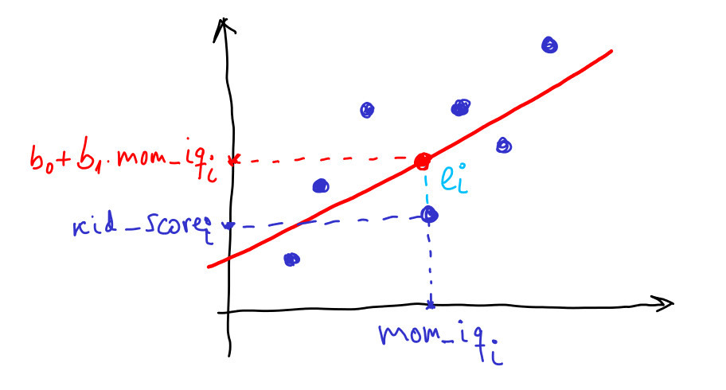

# Introducción

El primer paso es leer los datos correspondientes:

```{r}
load("datos/kidiq.Rdata")
str(d)
```
Se quiere estudiar si la puntuación obtenida por los niños (variable *kid_score*) está relacionada con la puntuación obtenida por las madres (*mom_iq*). Primero se dibuja el gráfico de dispersión:

```{r}
plot(d$mom_iq, d$kid_score)
```

Como se observa, en términos generales cuando mayor es la puntuación obtenida por las madres mayor es la puntuación de los niños. 

# Ecuación del modelo

El modelo más sencillo que relaciona ambas variables es el modelo lineal:

$$
kid\_score_i = b_0 + b_1 mom\_iq_i, \ i = 1,2,\cdots,n
$$

Es la ecuación de una recta. Sin embargo, es imposible calcular una recta que pase por todos los puntos del gráfico. En este caso se tiene que utilizar el modelo:

$$
kid\_score_i = b_0 + b_1 mom\_iq_i + e_i, \ i = 1,2,\cdots,n
$$

es decir, se incluye el término $e_i$ que modela la diferencia entre el valor observado en $kid\_score_i$ y el valor que toma la recta en ese punto ($b_0 + b_1 mom\_iq_i$).



Estos términos se denominan **residuos**, y se definen como:

$$
e_i = kid\_score_i - (b_0 + b_1 mom\_iq_i), \ i = 1,2,\cdots,n
$$


# Notación matricial del modelo

El modelo anterior se denomina **modelo de regresión lineal con un regresor**. De forma genérica se puede escribir así:

$$
kid\_score_i = b_0 + b_1 mom\_iq_i + e_i, \ i = 1,2,\cdots,n
$$

Si escribimos la ecuación para todos los datos disponibles:

$$
i = 1 \Rightarrow kid\_score_1 = b_0 + b_1 mom\_iq_1 + e_1
$$

$$
i = 2 \Rightarrow kid\_score_2 = b_0 + b_1 mom\_iq_2 + e_2
$$

$$
\cdots
$$

$$
i = n \Rightarrow kid\_score_n = b_0 + b_1 mom\_iq_n + e_n
$$

Agrupando:

$$
\begin{bmatrix}
kid\_score_1 \\ kid\_score_2 \\ \cdots \\ kid\_score_n
\end{bmatrix}
=
\begin{bmatrix}
1 & mom\_iq_1 \\
1 & mom\_iq_2 \\
\cdots &\cdots \\
1 & mom\_iq_n \\
\end{bmatrix}
\begin{bmatrix}
b_0 \\ b_1
\end{bmatrix}
+
\begin{bmatrix}
e_1 \\ e_2 \\ \cdots \\ e_n
\end{bmatrix}
$$

Finalmente, en notación matricial:

$$
y = X B + e
$$

donde $B$ es el vector de parámetros:

$$
B
=
\begin{bmatrix}
b_0 \\ b_1
\end{bmatrix}
$$

# Estimación del modelo usando mínimos cuadrados

El modelo propuesto depende de dos parámetros, $b_0$ y $b_1$, que son desconocidos. Existen diferentes métodos para calcular dichos parámetros, entre ellos, el método de mínimos cuadrados. Este método consiste en calcular el valor del vector $B$ que minimiza la suma de los residuos al cuadrado (RSS, *residuals sum of squares*):

$$
RSS = \sum e_i^2 = e^T e = (y - X B)^T(y - X B) = RSS(B)
$$

Desarrollando el producto:

$$
RSS(B) = y^T y - y^T X B - B^T X^T y + B^T X^T X B
$$

Para calcular el mínimo se deriva respecto a $B$ y se iguala a cero (ver [Apendice](lm_apendice_derivadas.html))

$$
\frac{d RSS(B)}{d B} = - X^T y - X^T y + (X^T X + X^T X) B = 0
$$

$$
B = (X^TX)^{-1}X^Ty
$$

# Datos, modelo y residuos

Los datos disponibles son 

$$
\{ kid\_score_i, \ mom\_iq_{i}\}, \ i = 1,\cdots,n
$$

Esos datos los modelamos utilizando la ecuación:

$$
kid\_score_i = b_0 + b_1 mom\_iq_i + e_i, \ i = 1,2,\cdots,n
$$

Es decir, para una madre dada $mom\_iq_i$, dividimos la puntuación de su hijo $kid\_score_i$ en dos partes: la parte que corresponde a la recta $b_0 + b_1 mom\_iq_i$ y los residuos $e_i$. La parte correspondiente a la recta se puede representar matricialmente como:

$$
\hat y = X B
$$

donde $\hat y = [\hat y_1 \ \hat y_2 \ \cdots \ \hat y_n]^T$. Por tanto los residuos se pueden calcular como

$$
e_i = y_i - \hat y_i, \ i = 1,2,\ldots,n
$$

o en forma matricial

$$
e = y - \hat y
$$

# Aplicacion a los datos del ejemplo

- Matrices del modelo

```{r}
y = matrix(d$kid_score, ncol = 1)
head(y)
```

```{r}
n = nrow(d)
X = cbind(rep(1,n), d$mom_iq)
head(X)
```

- Estimacion

```{r}
Xt_X = t(X) %*% X
Xt_y = t(X) %*% y
( B = solve(Xt_X) %*% Xt_y )
```

- valores de la recta

```{r}
y_e = X %*% B
```

Estos valores se pueden representar

```{r}
plot(d$mom_iq, d$kid_score)
points(d$mom_iq, y_e, col = "red", pch = 19)
```

Finalmente, los residuos se calculan haciendo

```{r}
e = y - y_e
```

```{r}
plot(d$mom_iq, e)
```


# Bondad del modelo ajustado

Es conveniente medir como de bueno es el ajuste del modelo. Una posibilidad es usar la suma de los residuos al cuadrado o RSS:

```{r}
(RSS = sum(e^2))
```

Pero esta variable depende de las unidades de x e y. Por tanto es difícil saber si un RSS alto indica que el modelo es bueno o malo. Lo ideal es utilizar variables adimensionales. La manera mas usual es utilizar el coeficiente de determinación o $R^2$:

$$
R^2 = 1 - \frac{RSS}{TSS}
$$

donde TSS es la suma total de cuadrados

$$
TSS = \sum(y_i - \bar y)^2
$$

```{r}
(TSS = sum((y-mean(y))^2))
(R2 = 1 - RSS/TSS)
```

El coeficiente $R^2$ toma valores entre cero y uno. Si $R^2 \approx 1 \Rightarrow RSS \ll TSS$, es decir, los residuos son muy pequeños en comparación a los datos, luego el modelo se ajusta muy bien a los datos. Cuando $R^2 \approx 0$, los residuos son muy grandes y el modelo no se ajusta bien a los datos.

La suma total de cuadrados de *y* está relacionado con su varianza, ya que

$$
s_y^2 = \frac{ \sum(y_i - \bar y)^2}{n-1} \Rightarrow TSS = (n-1)s_y^2
$$

```{r}
(n-1)*var(y)
```

