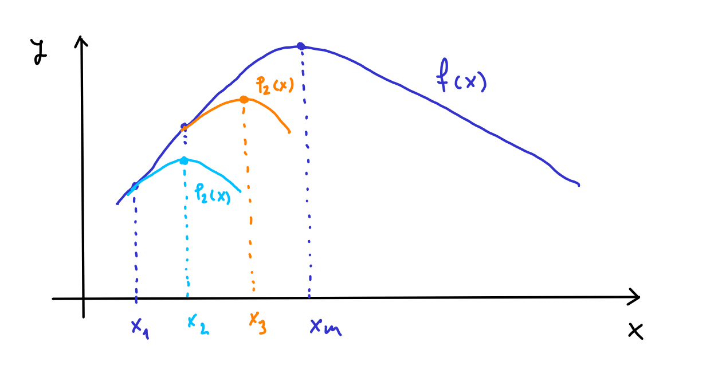

# Introduccion

El archivo *MichelinNY.csv* contiene linformación de 164 restaurantes franceses incluidos en la guía *Zagat Survey 2006: New York City Restaurants*.

```{r}
d = read.csv("datos/MichelinNY.csv")
str(d)
```

- **Restaurant.Name**: nombre del restaurante.
- **Food**: puntuación media de la comida otorgada por los clientes (sobre 30).
- **Decor**: puntuación media de la decoración otorgada por los clientes (sobre 30).
- **Service**: puntuación media del servicio otorgada por los clientes (sobre 30).
- **Price**: precio medio de la cena en dólares.
- **InMichelin**: vale 1 si el restaurante está en la Guía Michel y 0 si no está en dicha guía.

En este caso queremos analizar qué variables influyen en que un restaurante sea incluido en la Guía Michelín. Por tanto, la variable respuesta es *InMichelin*, es decir, una variable $y_i = \{0,1\}$. Podríamos pensar en un modelo de regresión lineal:

$$
InMichelin_i = \beta_0 + \beta_1 Food_i + u_i, \quad u_i \sim N(0,\sigma^2)
$$

```{r}
m = lm(InMichelin ~ Food, data = d)
plot(d$Food, d$InMichelin)
abline(m, col = "red")
```

Pero este modelo no es válido porque, entre otras razones, los residuos no tienen distribución normal ya que la respuesta es binaria, 0 y 1:

```{r}
plot(fitted.values(m), residuals(m))
```

# Modelo con un regresor

La alternativa es utilizar el **modelo de regresión logística**, que nos permite trabajar con variables respuesta binarias, $y_i = \{0,1\}$ (si la variable es un factor con dos niveles, se toma uno de los niveles como valor 1 y el otro como valor 0). La idea es seguir utilizando un modelo que relacione la variable respuesta y los regresores:

$$
y_i = f(x_{i})
$$

pero en el modelo de regresión logística se trabaja con probabilidades:

$$
P(y_i = \{0,1\}) = f(x_{i})
$$

En concreto se definen las siguientes probabilidades:

- $P(y_i = 1) = \pi_i$
- $P(y_i = 0) = 1 - \pi_i$,

donde:

$$
\pi_i = \frac{exp(\beta_0 + \beta_1 x_{i})}{1 + exp(\beta_0 + \beta_1 x_{i})} = \frac{1}{1 + exp(-\beta_0 - \beta_1 x_{i})}
$$

Como $\pi_i$ es una probabilidad debe tomar valores entre 0 y 1, y esa función lo cumple. Efectivamente:

$$
exp(-\beta_0 - \beta_1 x_{i}) > 0 \Rightarrow
$$

$$
1 + exp(-\beta_0 - \beta_1 x_{i}) > 1 \Rightarrow
$$

$$
\frac{1}{1 + exp(-\beta_0 - \beta_1 x_{i})} < 1
$$

A esta función se le conoce como **función logística**. Algunos ejemplos de esta función son:

```{r}
# ejemplo de función logística: beta0 = -6, beta1 = 1
x = seq(0,14,0.5)
logistica1 = 1/(1+exp(-6 + 1*x))
plot(x,logistica1, type = "b")
```

```{r}
# ejemplo de función logística: beta0 = 6, beta1 = -1
logistica2 = 1/(1+exp(6 - 1*x))
plot(x,logistica2, type = "b")
```

Este modelo también se conoce como **modelo logit**, ya que la función logit se define como:

$$
logit(x) = log \left( \frac{x}{1-x} \right)
$$

Por tanto:

$$
logit(\pi_i) = log \left( \frac{\pi_i}{1-\pi_i} \right) =  \beta_0 + \beta_1 x_i
$$

# Estimación de los parámetros del modelo: máxima verosimilitud

Para estimar los parámetros del modelo ($\beta_0$ y $\beta_1$) se utiliza el método de máxima verosimilitud, que consiste en:

- Definir la función logaritmo de la verosimilitud;
- Los estimadores de los parámetros son aquellos que maximizan la funcion log-verosimilitud.

## La función de verosimilitud

La función de verosimilitud es la probabilidad de obtener la muestra dada. En primer lugar reescribimos el modelo como:

$$
P(Y_i = y_i) = \pi_i^{y_i} (1 - \pi_i)^{1-y_i}, \quad y_i = 0,1, \quad i = 1,2,\ldots,n
$$

Efectivamente

$$
P(Y_i = 1) = \pi_i, \quad P(Y_i = 0) = 1-\pi_i
$$

Por tanto, dada la muestra $\{Y_1 = y_1, Y_2 = y_2, \cdots, Y_n = y_n \}$, la probabilidad de obtener dicha muestra es:

$$
P(Y_1 = y_1, Y_2 = y_2, \cdots, Y_n = y_n) = \prod_{i=1}^{n} P(Y_i = y_i) = \prod_{i=1}^{n} \pi_i^{y_i} (1 - \pi_i)^{1-y_i} 
$$

Se denomina función de verosimilitud a la probabilidad de obtener la muestra:

$$
L(\beta) = \prod_{i=1}^{n} \pi_i^{y_i} (1 - \pi_i)^{1-y_i}
$$

donde $\beta = [\beta_0 \quad \beta_1]^T$. Efectivamente, la función de verosimilitud es función de $\beta$ ya que $\pi_i$ depende de $\beta$.

Se suele trabajar con logaritmos ya que: 1) transforma los productos en sumas y es más fácil trabajar con sumas; 2) el máximo de $log L(\beta)$ y de $L(\beta)$ se alcanzan en el mismo punto ya que el logaritmo es una función monótona creciente (recordad que el método de máxima verosimilitud consiste en encontrar el máximo de la verosimilitud).

$$
log L(\beta) = log \prod_{i=1}^{n} \pi_i^{y_i} (1 - \pi_i)^{1-y_i} = \sum_{i=1}^{n}(y_i log(\pi_i) +  (1-y_i) log(1 - \pi_i))
$$

$$
= \sum_{i=1}^{n}\left( y_i log \left(\frac{exp(\beta_0 + \beta_1 x_{i})}{1 + exp(\beta_0 + \beta_1 x_{i})}\right) +  (1-y_i) log\left(1 - \frac{exp(\beta_0 + \beta_1 x_{i})}{1 + exp(\beta_0 + \beta_1 x_{i})}\right) \right)
$$

$$
= \sum_{i=1}^{n}\left( y_i log \left(\frac{exp(\beta_0 + \beta_1 x_{i})}{1 + exp(\beta_0 + \beta_1 x_{i})}\right) +  (1-y_i) log\left(\frac{1}{1 + exp(\beta_0 + \beta_1 x_{i})}\right) \right)
$$

$$
= \sum_{i=1}^{n}( y_i log(exp(\beta_0 + \beta_1 x_{i}) - y_i log (1 + exp(\beta_0 + \beta_1 x_{i})) -  (1-y_i) log(1 + exp(\beta_0 + \beta_1 x_{i})) )
$$
$$
= \sum_{i=1}^{n}( y_i (\beta_0 + \beta_1 x_{i}) - log (1 + exp(\beta_0 + \beta_1 x_{i})) )
$$

En R, la función de verosimilitud la podemos calcular así:

```{r}
logit1_logL = function(beta,y,x){
  # beta = [beta0 beta1]
  n = length(y)
  suma = 0
  for (i in 1:n){
    suma = suma + y[i]*(beta[1] + beta[2]*x[i]) - 
      log(1 + exp(beta[1] + beta[2]*x[i]))
  }
  return(suma)
}
```

Por ejemplo, para $\beta_0 = -12$ y $\beta_1 = 1$, la función de verosimilitud vale:

```{r}
beta = c(-12,1)
logit1_logL(beta,d$InMichelin,d$Food)
```

## El máximo de la función de verosimilitud

Tenemos que derivar e igualar a cero:

$$
\frac{\partial logL(\beta)}{\partial \beta_0} = \sum_{i=1}^{n} \left( y_i  - \frac{exp(\beta_0 + \beta_1 x_{i})}{1+exp(\beta_0 + \beta_1 x_{i})} \right) = \sum_{i=1}^{n} (y_i  - \pi_i)
$$

$$
\frac{\partial logL(\beta)}{\partial \beta_1} = \sum_{i=1}^{n} \left( y_i x_i  - \frac{x_i exp(\beta_0 + \beta_1 x_{i})}{1+exp(\beta_0 + \beta_1 x_{i})} \right) = \sum_{i=1}^{n} x_i(y_i  - \pi_i)
$$

En forma matricial tenemos el vector gradiente:

$$
\frac{\partial logL(\beta)}{\partial \beta} 
=
\begin{bmatrix}
\frac{\partial logL(\beta)}{\partial \beta_0} \\ 
\frac{\partial logL(\beta)}{\partial \beta_1}
\end{bmatrix}
= \sum_{i=1}^n
\begin{bmatrix}
1 \\
x_{i}
\end{bmatrix}
(y_i  - \pi_i)
=
X^T(y  - \pi)
$$

donde $X$ es la matriz de regresores:

$$
X = 
\begin{bmatrix}
1 & x_1 \\
1 & x_2 \\
\cdots &\cdots \\
1 & x_n \\
\end{bmatrix}
, \quad
y = 
\begin{bmatrix}
y_1 \\ y_2 \\ \cdots \\ y_n
\end{bmatrix}
, \quad
\pi = 
\begin{bmatrix}
\pi_1 \\ \pi_2 \\ \cdots \\ \pi_n
\end{bmatrix}
$$

Verifiquemos la expresión anterior con un ejemplo. Supongamos que tenemos tres datos: $(y_1,x_1), (y_2,x_2), (y_3,x_3)$:

$$
\frac{\partial logL(\beta)}{\partial \beta_0} = \sum_{i=1}^{n} (y_i  - \pi_i) = (y_1-\pi_1) + (y_2-\pi_2) + (y_3-\pi_3)
$$

$$
\frac{\partial logL(\beta)}{\partial \beta_1} = \sum_{i=1}^{n} x_i(y_i  - \pi_i) =  x_1(y_1-\pi_1) + x_2(y_2-\pi_2) + 
x_3(y_3-\pi_3)
$$

En forma matricial:

$$
X = 
\begin{bmatrix}
1 & x_1 \\
1 & x_2 \\
1 & x_3 \\
\end{bmatrix}
, \quad
y = 
\begin{bmatrix}
y_1 \\ y_2 \\ y_3
\end{bmatrix}
, \quad
\pi = 
\begin{bmatrix}
\pi_1 \\ \pi_2 \\ \pi_3
\end{bmatrix}
$$

$$
\frac{\partial logL(\beta)}{\partial \beta} 
=
\begin{bmatrix}
\frac{\partial logL(\beta)}{\partial \beta_0} \\ 
\frac{\partial logL(\beta)}{\partial \beta_1}
\end{bmatrix}
=
X^T(y  - \pi)
$$

$$
=
\begin{bmatrix}
1 & 1 & 1\\
x_1 & x_2 & x_3
\end{bmatrix}
%
\begin{bmatrix}
y_1 - \pi_1 \\ y_2 - \pi_2  \\ y_3 - \pi_3
\end{bmatrix}
= 
\begin{bmatrix}
(y_1-\pi_1) + (y_2-\pi_2) + (y_3-\pi_3) \\
x_1(y_1-\pi_1) + x_2(y_2-\pi_2) + x_3(y_3-\pi_3)
\end{bmatrix}
$$

Luego ambas expresiones son equivalentes. 

El máximo se haya igualando a cero:

$$
\frac{\partial logL(\beta)}{\partial \beta} 
=
X^T(y  - \pi)
=
\begin{bmatrix}
0 \\
0
\end{bmatrix}
$$

Sin embargo no es posible despejar $\beta_0$ y $\beta_1$ de las ecuaciones anteriores. El máximo de la función log-verosimilitud se tiene que encontrar numéricamente.

En los siguientes apartados también se va a necesitar la matriz de derivadas segundas o matriz hessiana. Su valor es:

$$
\frac{\partial^2 logL(\beta)}{\partial \beta_0^2} = \sum_{i=1}^{n} \left( - \frac{exp(w)(1+exp(w)) - exp(w)^2}{(1+exp(w))^2} \right) = \sum_{i=1}^{n} \left( - \frac{exp(w)}{(1+exp(w))} + \frac{exp(w)^2}{(1+exp(w))^2} \right) = - \sum_{i=1}^{n} \pi_i(1  - \pi_i)
$$

$$
\frac{\partial^2 logL(\beta)}{\partial \beta_0 \partial \beta_1} = \sum_{i=1}^{n} \left( - \frac{x_i exp(w)(1+exp(w)) - x_iexp(w)^2}{(1+exp(w))^2} \right)  = -\sum_{i=1}^{n} \pi_i(1  - \pi_i)x_i
$$

$$
\frac{\partial^2 logL(\beta)}{\partial \beta_1^2} = \sum_{i=1}^{n} x_i \left( - \frac{x_i exp(w)(1+exp(w)) - x_iexp(w)^2}{(1+exp(w))^2} \right)   = -\sum_{i=1}^{n} \pi_i(1  - \pi_i)x_i^2
$$

donde se ha utilizado que $w = \beta_0 + \beta_1 x_{i}$. En forma matricial

$$
\frac{\partial log L(\beta)}{\partial \beta \partial \beta^T}
=
\begin{bmatrix}
\frac{\partial^2 logL(\beta)}{\partial \beta_0^2} &  \frac{\partial^2 logL(\beta)}{\partial \beta_0 \partial \beta_1} \\ 
\frac{\partial^2 logL(\beta)}{\partial \beta_0 \partial \beta_1} & \frac{\partial^2 logL(\beta)}{\partial \beta_1^2}
\end{bmatrix}
= - \sum_{i=1}^n
\begin{bmatrix}
1 \\
x_{i}
\end{bmatrix}
\pi_i(1  - \pi_i)
\begin{bmatrix}
1 & x_{i}
\end{bmatrix}
=
- X^T W X
$$

donde $W$ es una matriz diagonal con

$$
W_{ii} = \pi_i(1-\pi_i)
$$

En R:

```{r}
logit1_grad = function(beta,y,x){
  n = length(y)
  X = cbind(rep(1,n),x)
  y = matrix(y, nrow = n, ncol = 1)
  pi = matrix(0, nrow = n, ncol = 1)
  for (i in 1:n){
    pi[i,1] = exp(beta[1] + beta[2]*x[i])/(1 + exp(beta[1] + beta[2]*x[i]))
  }
  grad = t(X) %*% (y - pi)
  return(grad)
}
```

Comprobacion:

```{r}
beta = c(-12,1)
logit1_grad(beta, d$InMichelin, d$Food)
```

```{r}
logit1_hess = function(beta,x){
  n = length(x)
  X = cbind(rep(1,n),x)
  W = matrix(0, nrow = n, ncol = n)
  for (i in 1:n){
    pi = exp(beta[1] + beta[2]*x[i])/(1 + exp(beta[1] + beta[2]*x[i]))
    W[i,i] = pi*(1-pi)
  }
  hess = -t(X) %*% W %*% X
  return(hess)
}
```

```{r}
beta = c(-12,1)
logit1_hess(beta, d$Food)
```

```{r}
# fdHess es una función del paquete nlme que
# calcula el gradiente y el hessiano numéricamente 
# mediante diferencias finitas 
# (se utiliza aquí para comprobar los resultados)
nlme::fdHess(beta,logit1_logL, y = d$InMichelin, x = d$Food)
```

## Algoritmo de Newton-Raphson

Queremos encontrar el máximo de la función f(x). Para ello aproximamos la función en el entorno de un punto dado $x_1$ por un polinomio de segundo grado (polinomio de Taylor de segundo grado):

$$
f(x) = p_2(x) + e(x)
$$

donde

$$
p_2(x) = f(x_1) + f'(x_1)(x-x_1) + \frac{1}{2}f''(x_1)(x-x_1)^2
$$

y $e(x)$ es el error cometido en dicha aproximación. 



Derivamos para encontrar el máximo del polinomio $p_2(x)$:

$$
\frac{\partial p_2(x)}{\partial x} = f'(x_1) + f''(x_1)(x-x_1) = 0
$$

El máximo de $p_2(x)$ se encuentra en 

$$
x_{2} = x_1 - \frac{f'(x_1)}{f''(x_1)}
$$

El máximo de $f(x)$ estará más próximo a $x_2$ que a $x_1$. Pero podemos mejorar el resultado repitiendo el proceso: se vuelve a aproximar $f(x)$ por un polinomio de orden 2 en el entorno de $x_2$ y el nuevo máximo obtenido, $x_3$, estará más próximo al máximo de $f(x)$:

$$
p_2(x) = f(x_2) + f'(x_2)(x-x_2) + \frac{1}{2}f''(x_2)(x-x_2)^2
$$

$$
\frac{\partial p_2(x)}{\partial x} = f'(x_2) + f''(x_2)(x-x_2) = 0
$$

$$
x_{3} = x_2 - \frac{f'(x_2)}{f''(x_2)}
$$

Y así sucesivamente, obteniendo el algoritmo:

$$
x_{k+1} = x_k - \frac{f'(x_k)}{f''(x_k)}, \quad k = 1,2, \cdots
$$

Se puede demostrar que este algoritmo converge al máximo de $f(x)$. Este procedimiento se conoce como el **algoritmo de Newton**.

Si la función es multivariante, el polinomio de Taylor de segundo orden es:

$$
p_2(x) = f(x_k) + (x - x_k)^T G_k + \frac{1}{2}(x - x_k)^T H_k(x - x_k)
$$

donde $x = [x_1 \ x_2 \ \cdots \ x_n]^T$, $x_k = [x_{1,k} \ x_{2,k} \ \cdots \ x_{n,k}]^T$, $G_k$ es el vector gradiente de *f* calculado en $x_k$, y $H_k$ es la matriz hessiana de *f* calculada en $x_k$. Por tanto, el algoritmo de Newton en caso de funciones multivariantes es:

$$
x_{k+1} = x_k - H^{-1}_k G_k
$$

El algoritmo de Newton funciona muy bien en las proximidades del máximo. Sin embargo, lejos del máximo la convergencia es muy lenta y puede incluso que el algoritmo no converja. Es habitual introducir un coeficiente $\alpha$ en el algoritmo:

$$
x_{k+1} = x_k - \alpha H^{-1}_k G_k
$$

El valor de $\alpha$ se tiene que calcular en cada caso particular, para lo que se utilizan [algoritmos de búsqueda lineal](https://en.wikipedia.org/wiki/Line_search). El cálculo de valor óptimo de $\alpha$ queda fuera del alcance y de los objetivos de la asignatura. Nosotros vamos a utilizar $\alpha = 0.1$, que da resultados aceptables para las datos analizados.

Por último, como las variables de la función log-verosimilitud son $\beta = [\beta_0 \ \beta_1]^T$, el algoritmo de Newton se escribe en nuestro caso como:

$$
\beta_{k+1} = \beta_k - \alpha H^{-1}_k G_k
$$

El algoritmo de Newton para la función log-verosimilitud se puede implementar en R de manera sencilla:

```{r}
logit1_Newton = function(beta_i, y, x, max_iter = 100, tol = 10^(-6), alfa = 0.1){
  
  # punto de partida
  beta = beta_i
  
  iter = 1
  tol1 = Inf
  while ((iter <= max_iter) & (tol1 > tol)){
    fun = logit1_logL(beta,y,x)
    grad = logit1_grad(beta,y,x)
    hess = logit1_hess(beta,x)
    beta = beta - alfa*solve(hess) %*% grad
    fun1 = logit1_logL(beta,y,x)
    tol1 = abs((fun1-fun)/fun)
    print(paste("Iteracion ",iter," log-verosimilitud ",fun1))
    iter = iter + 1
  }
  return(beta)
}
```

Como punto de partida podemos utilizar por ejemplo la solución de mínimos cuadrados:

```{r}
m = lm(InMichelin ~ Food, data = d)
beta_i = coef(m)
logit1_Newton(beta_i,d$InMichelin,d$Food)
```

## Algoritmo BFGS

El algoritmo de Newton tiene el inconveniente de que necesita calcular la inversa de la matriz hessiana. Esto a veces causa problemas numéricos si la matriz hessiana está mal condicionada. Otra alternativa es utilizar el algoritmo BFGS para maximizar la función log-versosimilitud. Este algoritmo, en lugar de calcular la inversa del hessiano, utiliza una aproximación a esta matriz que es numéricamente más estable. El algoritmo consiste en:

$$
x_{k+1} = x_k - \alpha_k B_k G_k
$$

donde $B_k$ es una aproximación de $H^{-1}_k$ [(ver más sobre esta matriz)](https://en.wikipedia.org/wiki/Broyden%E2%80%93Fletcher%E2%80%93Goldfarb%E2%80%93Shanno_algorithm). Por eso a este algoritmo se le encuadra dentro de los algoritmos cuasi-Newton.

En R, el algoritmo BFGS está implementado en la función *optim()*. La función *optim(f)* siempre minimiza la función *f*, pero nosotros queremos calcular el máximo (por eso hablamos de máxima verosimilitud). Para resolver este inconveniente tenemos en cuenta que *max(f) = - min(-f)*. Por tanto, definimos una nueva función de verosimilitud que es la que vamos a minimizar

```{r}
logit1_logL_optim = function(beta,y,x){
  logL = logit1_logL(beta,y,x)
  return(-logL)
}
```

Utilizando el mismo punto de partida que para el algoritmo Newton:

```{r}
mle = optim(par = beta_i, fn = logit1_logL_optim, y = d$InMichelin, x = d$Food, gr = NULL, method = "BFGS", hessian = TRUE, control = list(trace=1, REPORT = 1, maxit = 200))
mle$par
```

## Estimacion con R

### Con variable respuesta 0-1

```{r}
m2 = glm(InMichelin ~ Food, data = d, family = binomial)
summary(m2)
```

Internamente la función glm() utiliza el algoritmo de Newton. 

El modelo que estamos estimando es:

$$
P (Y_i = 1) = \frac{exp(\beta_0 + \beta_1 x_i)}{1 + exp(\beta_0 + \beta_1 x_i)}
$$

### Con variable respuesta como factor

Pero la manera natural de trabajar con variables cualitativas en R es definirlas como factores.

```{r}
d$InMichelin = factor(d$InMichelin, labels = c("No","Yes"))
str(d)
```

```{r}
m3 = glm(InMichelin ~ Food, data = d, family = binomial)
summary(m3)
```

El modelo que estamos estimando es:

$$
P (Y_i = Yes) = \frac{exp(\beta_0 + \beta_1 x_i)}{1 + exp(\beta_0 + \beta_1 x_i)}
$$

Podemos cambiar el nivel de referencia de la variable respuesta:

```{r}
d$InMichelin = relevel(d$InMichelin, ref = "Yes")
m4 = glm(InMichelin ~ Food, data = d, family = binomial)
summary(m4)
```

El modelo que estamos estimando ahora es:

$$
P (Y_i = No) = \frac{exp(\beta_0^* + \beta_1^* x_i)}{1 + exp(\beta_0^* + \beta_1^* x_i)}
$$

De la salida de R hemos visto que en este caso $\beta_0 = - \beta_0^*$ y $\beta_1 = - \beta_1^*$. Veamos que esto siempre es así. Se tiene que

$$
P(Y_i = Yes) = 1 - P(Y_i = No)
$$

$$
\frac{exp(\beta_0 + \beta_1 x_i)}{1 + exp(\beta_0 + \beta_1 x_i)} = 1 - \frac{exp(\beta_0^* + \beta_1^* x_i)}{1 + exp(\beta_0^* + \beta_1^* x_i)}
$$

Operando se tiene que:

$$
exp(\beta_0 + \beta_0^* + (\beta_1 + \beta_1^*) x_i) = 1
$$

Por tanto, $\beta_0 + \beta_0^* = 0$ y $\beta_1 + \beta_1^* = 0$.

